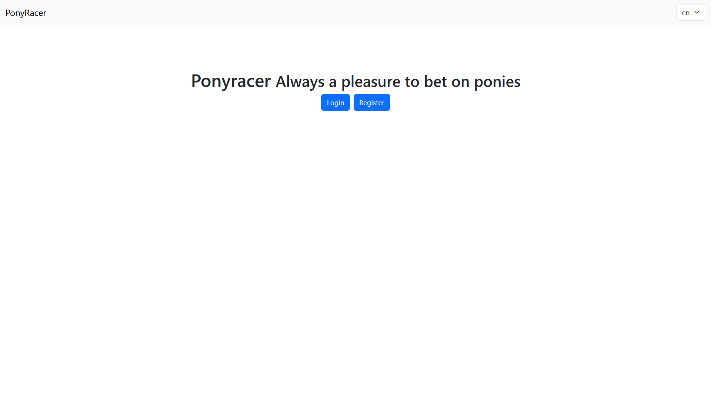
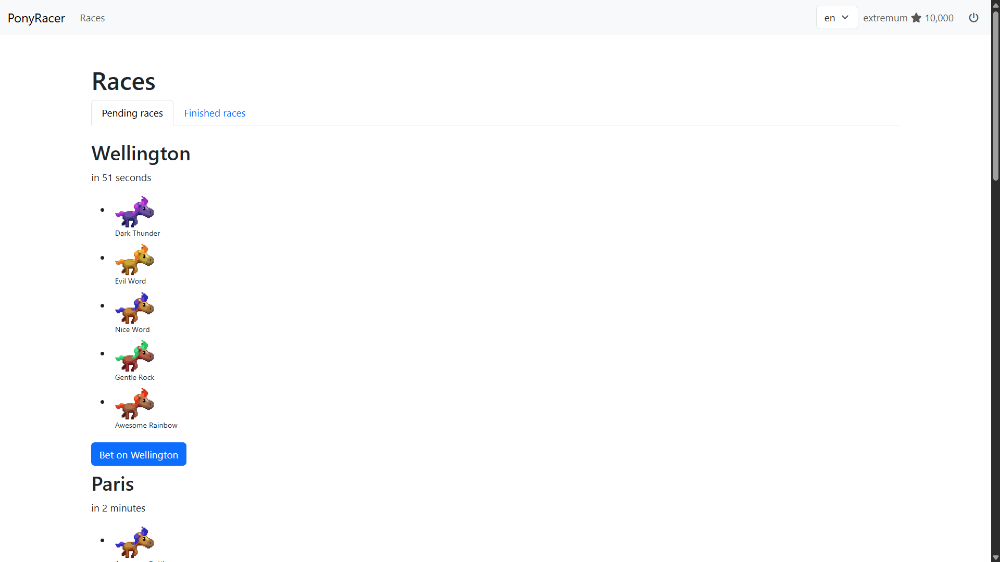
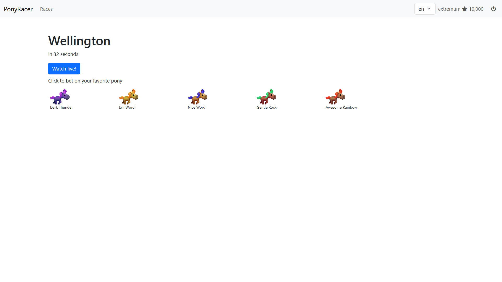
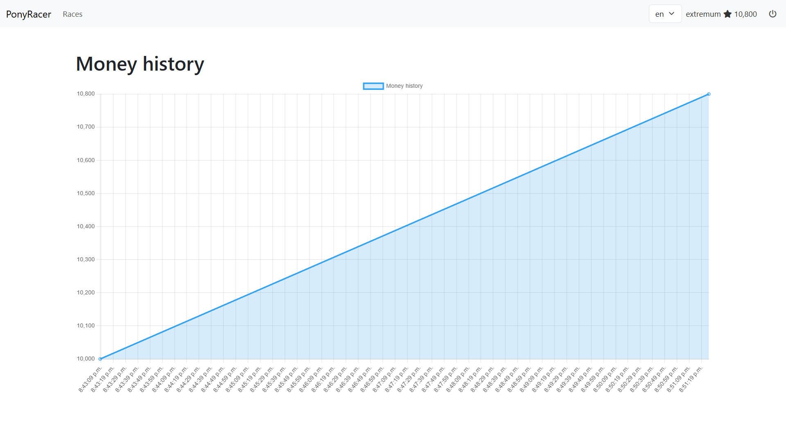

# Ponyracer

A fun app where you can bet on pony races. It was built while completing exercises from the **Angular Pro Pack** by [Ninja Squad](https://ninja-squad.com).

## Demo

You can check out a live demo [here](https://ng-ponyracer.netlify.app/).

## Tech stack

- [Angular 18](https://angular.dev/)
- [Bootstrap 5](https://getbootstrap.com/) for styling
- [ng-bootstrap](https://ng-bootstrap.github.io/) for UI components like `alert` and `pagination`
- [Chart.js](https://www.chartjs.org/) for data visualization
- [date-fns](https://date-fns.org/) for nice date formatting
- [webstomp-client](https://www.npmjs.com/package/webstomp-client) for live updates over WebSocket
- [Transloco](https://jsverse.gitbook.io/transloco/) for multi-language support

## Get started

### Requirements

- [Node.js](https://nodejs.org)
- [npm](https://www.npmjs.com/) or [pnpm](https://pnpm.io/)
- [Angular CLI](https://angular.dev/tools/cli) (optional)

### Installation

Clone and install the dependencies:

```bash
git clone https://github.com/extremum9/ponyracer.git
cd ponyracer
npm install
```

Then run the app:

```bash
ng serve
```

> [!TIP]
> If you don't have Angular CLI installed globally, you can still run the project with `npx ng serve`.

Go to http://localhost:4200 in your browser.

## Screenshots

### Home



### Races



### Race



### Live race


### Money history


